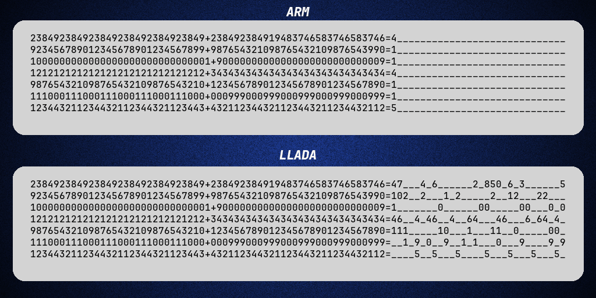

# LLaDA: From Text Generation to Arithmetic Operations

In this repository, we provide a complete implementation of the training and inference pipeline for [LLaDA](https://arxiv.org/pdf/2502.09992), applied to arithmetic operations and sorting tasks.
<p align="center">
  
</p>


## Installation

Install the dependencies:

```bash
conda env create -f environment.yaml
conda activate llm_project
```

### Run the project
To run train and run LLaDA:
```bash
python src/main.py --method llada --tokenizer group_pad --num_epochs 5 --number_bits 20 --device cpu --data_size 64000 --batch_size 32 --learning_rate 5e-4 --seq_length 21
```

To train the model using Kaggle's GPU, ensure you have a Kaggle account and API key, adapt the `kaggle/kernel-metadata.json` file to your Kaggle username, and run:
```bash
kaggle kernels push -p kaggle/
```


## Acknowledgements

We would like to thank:
* The authors of the paper [Large Language Diffusion Models](https://ml-gsai.github.io/LLaDA-demo/) from which we are basing this project.

## Contact and Contributors

This project is conducted by: [Nicolas Sereyjol-Garros](https://github.com/nicolas-srjg), [Tom Ravaud](https://github.com/TomRavaud), [Christopher Marouani](https://github.com/chris-mrn), and [Lounès Meddahi](https://github.com/LounesMD).
